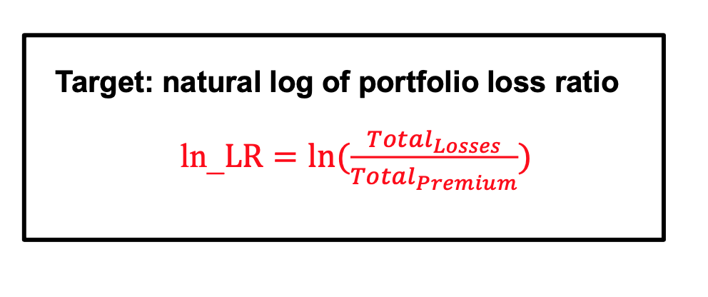
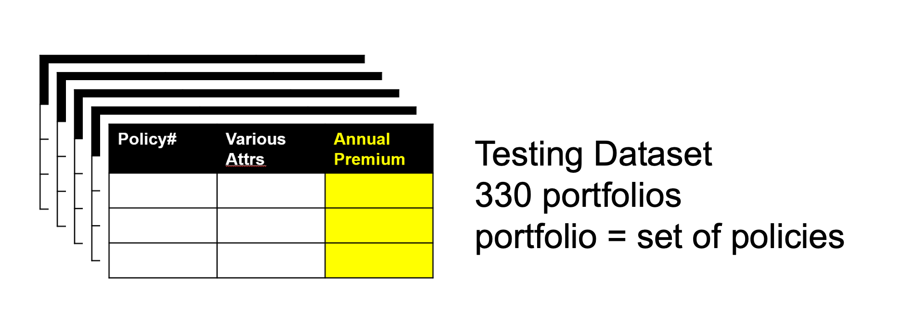
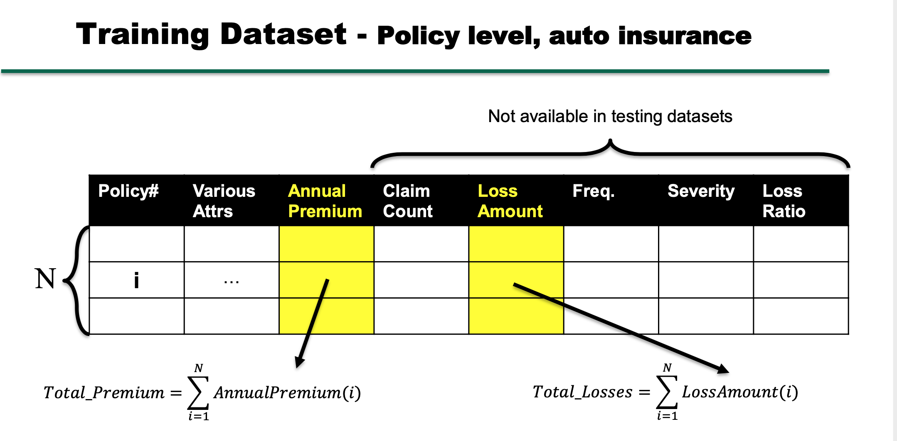
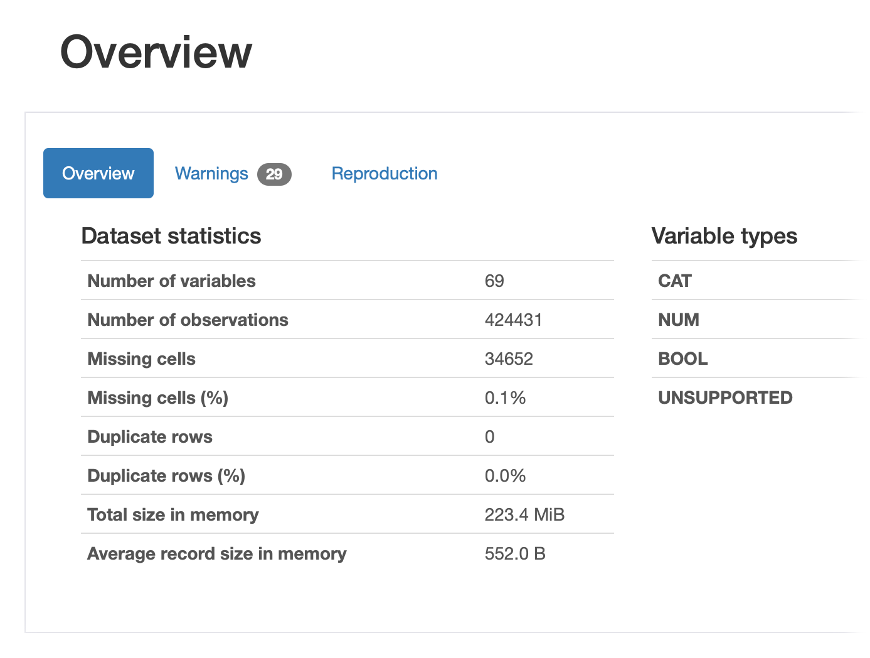
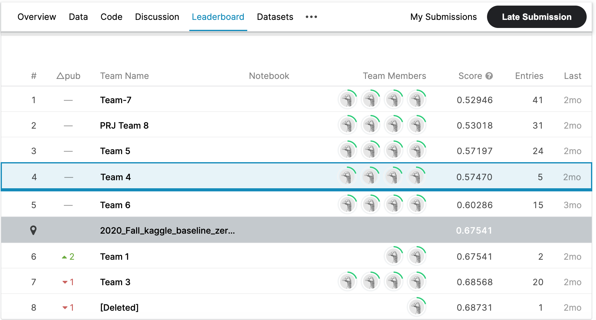

# Auto Insurance Loss Ratio Predictions
We developed predictive model that predicts loss ratio for each portfolio of auto insurance policies. The loss ratio is the ratio of total losses to the total premium of the amount. 

The key idea was to create a predictive model that gives an advantage for an auto insurance company to predict loss ratio of policies. This advantage will give an insurance company opportunity to make a decision of premium rates based on the overall risk of a portfolio.  The key problem was that 50% of all policies can be mispriced by more or less than 10%. 

The model built on the database of historical 400k input samples of auto insurance policies which have 69 features. Most of these features are categorical. The training dataset comprises a set of attributes of portfolios, such as policy number, vehicle make year, vehicle usage, driver age, marriage status, annual premium, claim count, loss amount, loss ratio, and other attributes. 

The target is natural logarithm of the loss ratio of portfolio. 

The testing dataset has 330 testing portfolios. 

Each portfolio consists of 1000 to 5000 policies. The difference between training dataset and testing dataset is that testing dataset does not have loss amount, loss ratio, claim count, freq., and severity. 

The problem which we faced during this project is that our dataset is imbalanced, and we would have outliers.

- Exploratory data analysis: During this step we got the information of datatypes, for better understanding what attributes are numerical and what are categorical. We displayed a statistical overview of the data, and checked if we have any missing data. 
We used pandas-profiling to get the report of our data. The report gave us better understanding of our data. 

- Data preprocessing: During this step we selected features, checked missing values, and created dummy variables.  We created portfolios of training data where each portfolio has from 1000 to 5000 policies, and percentage of losses. For each training portfolio we engineered a set of features that summarizes the data in that portfolio, for example, the mean of driver age.
- Modeling: Linear Regression, Ridge Regression, Decision Tree, XGBoost, Random Forest, KNN
- Evaluation: Splitting training portfolios intro training and holdout sets; Calculate Root Mean Squared Error (RMSE) and Mean Absolute Error (MAE; Predict loss amount on the testing portfolios; Calculate Natural Logarithm 

- Predictions/Results

